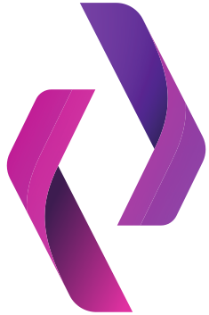

### Hi, I'm Ayush Yadav 👋 
#     

 
B.Tech CSE graduate from IIIT Vadodara. Experienced with demonstrated working in Front-end libraries & frameworks like React.js, Angular, and Next.js and various JS libraries for development. Passionate about creating beautiful web apps to make people’s experiences with technology memorable.  
💻 Software Developer  
📚 Studying Technologies 
👨‍💻 Graduated in B.Tech CSE from IIITV 
🐱‍💻 Working 

### My skills:           

  <table>
    <tr>
        <td></td>
        <td></td>
    </tr>   
  </table>

<!--
**ayushy11/ayushy11** is a ✨ _special_ ✨ repository because its `README.md` (this file) appears on your GitHub profile.

